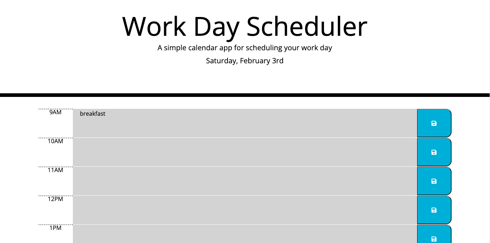
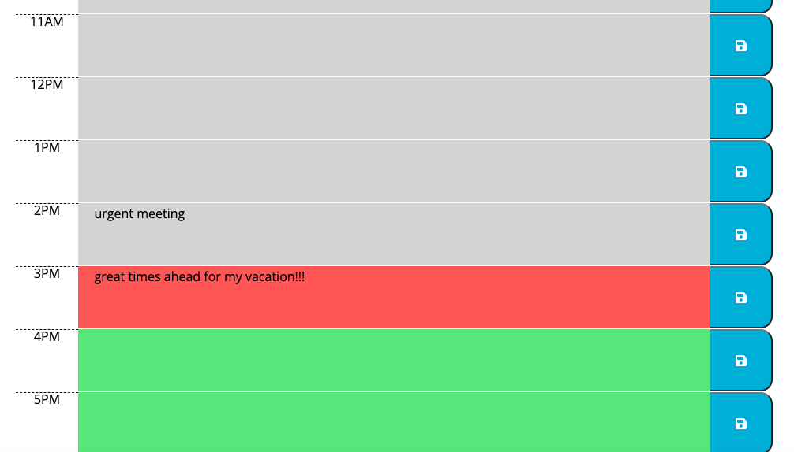

# challenge-5-work-day-scheduler

## Challenge Requirements
* Create a work day scheduler
* Displays the current day at the top of the calendar
* Includes time blocks for standard business hours
* Each time block is color-coded to indicate whether it is in the past(white), present(red), or future(green).
* The user can click into a time block to add/update an event.
* The user can click the save button and the event is saved into local storage.
* When the user refreshes the page, the saved events stays on screen.

## Website Screenshot

## Link to Portfolio Website
[Deployed Website](johnlott1.github.io/Challenge-5/)
